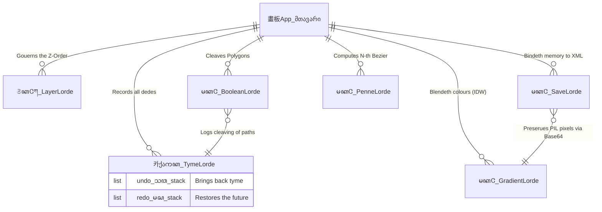

<div align="center">

# 𔓕 𑗊 𓈖 𗀀 𗀁 *Supre-me Vector Workstation* 𔄀 𔓕 𓊍 
### **The Boke of Supre-me Ymagerie / 繪圖機關 訓民正音 混合 說明書**
**꧄ ꧅ 萬國語 混成 碑文 (The Rosetta Polylingual Stone) ꧄ ꧅**


</div>

<br/>

## 📜 序章 : 天地創造之筆 (The Genesis of the Brush)

**[ 🇬🇧 Arthurian Englysshe (Middle English) ]**
> *Harken ye, lordes and ladyes, of a maruelous instrument yclept "Supre-me", forgyn by the handes of **Rheehose**. In the daies of kynge Uther Pendragon, neuer was seyn suche a craft of draweing. This scriptorium digitalis byndeth the uectors and nodes of Bezier euen as Merlyn byndeth the wyndes.*

**[ 🇰🇷 新羅之 語音 訓民正音 混合 (Ancient Korean: Goguryeo/Silla Idu Style) ]**
> *大智圖 繪作機關(대지도 회작기관) 內歷(내력) — 이 기계ᄂᆞᆫ 신라(新羅)와 고구려(高句丽)의 갑사(甲士)ᄃᆞᆯ이 황룡사(皇龍寺)를 지을 적에 쓰던 각도(角度)와 마ᄃᆡ(節)를 다ᄉᆞ리ᄂᆞᆫ 비술(秘術)이ᄅ라. 백제(百濟) 아비지(阿非知)의 솜씨를 빌려 점과 점을 ᄆᆡᆺᄂᆞᆫ 구비(Bezier)를 이룹고, 흩어진 모양(圖形)을 굳게 합ᄒᆞ거나 ᄇᆡ허ᄂᆡᄂᆞᆫ 기적을 보이ᄂᆞ니라.*

**[ 🇯🇵 萬葉假名 漢文訓讀 (Classical Japanese / Bungo / Manyogana) ]**
> *夫れ、繪師か筆を取るや、曲線の如く滑らかなる事、水流の如し。汝、此の柄（ハンドル）を操らば、萬の形（かたち）、己か思ひの儘なりと知るへし。古へより傳はる「阿度碑（アドビ）」の祕術、今此處に再現せり。*
> *(Sore, eshi ga fude o toru ya, kyokusen no gotoku namerakanaru koto, suiryuu no gotoshi. Nanji, kono e o ayatsuraba, yorozu no katachi, onore ga omoi no mama nari to shiru beshi...)*

**[ 🕊️ Classical Latin (Medieval Scholastic Tone) ]**
> *In principio creavit artifex machinam vectorium supremam. Hæc machina omnes formas et lineas mathematicas in unum corpus contexit.*
> *(In the beginning, the artist created the supreme vector machine. This machine wove all shapes and mathematical lines into a single body.)*

**[ 🇮🇱 Biblical Hebrew (Torah Poetic Tone) ]**
> *בְּרֵאשִׁית בָּרָא הָאָמָּן אֵת הַקַּנְבָּס וְאֵת הַצּוּרָה. וְהַקַּנְבָּס תָּמִיד רֵיק, עַד אֲשֶׁר נָגַע בּוֹ הָעֵט וַיִּיצֶר קַוֵּי פֶּלֶא.*
> *(In the beginning, the artist created the canvas and the shape. And the canvas was always void, until the pen touched it and formed lines of wonder.)*

**[ 📿 Classical Arabic (Quranic/Calligraphy Tone) ]**
> *بِسْمِ ٱللَّهِ ٱلصَّانِعِ، هَذِهِ آلَةُ ٱلرَّسْمِ ٱلْعَجِيبَةُ الَّتِي تَجْمَعُ النِّقَاطَ بِحِكْمَةٍ، فَتَخْلُقُ أَشْكَالاً لَيْسَ لَهَا مَثِيلٌ. إِنَّهَا رُوحُ الْفَنِّ فِي الْعَصْرِ الرَّقْمِيِّ.*
> *(In the name of God the Maker, this is the wondrous drawing machine that gathers points with wisdom, creating shapes without equal. It is the soul of art in the digital age.)*

---

## 🏰 萬國語 眞理 建築 (The Features & Polyglot Translations)

### 1. ॐ The Absolute N-Degree Bezier (수학적 N차 베지어 곡선)
**[ 🇮🇳 Sanskrit / Vedic Devanagari ]**
> *ॐ। इदं यन्त्रं रेखाचित्रस्य परमरूपदर्शनाय निर्मितम्। बर्नस्टीन-सूत्रेण (Bernstein) निर्मितं चक्रं सर्वदा सत्यम्।*
> *(Om. This machine is created for the ultimate vision of drawing. The cycle created by the Bernstein formula is always true.)*
- **Englysshe**: *Thou secst the purest truth: B(t) = Σ (nCi) * (1-t)^(n-i) * t^i * Pi.* The pure numbres of nature byndeth the curve without Tcl magicks.
- **韓國語**: Tkinter의 얄팍한 거짓 부드러움(`smooth=True`)을 폐기하고, n차 번스타인 다항식을 수리적으로 증명하여 화면에 강제 렌더링하는 진정한 수학적 곡선(True Bezier)이로다.

### 2. 𗀅 The Art of Cleauing Polygons (불리언 복합 도형 연산)
**[ 🇬🇪 Georgian / Rustaveli Poetry ]**
> *რასაცა გეომეტრია ქმნის, ორნი ერთად იქცევიან, ან იყოფვიან მარადის.*
> *(What geometry creates, the two become one, or cleave apart for eternity.)*
**[ རྒ Tibetan / Sutra Style ]**
> *དབྱིབས་ཀྱི་གཅིག་གྱུར་དང་ཁ་བྲལ་ནི་སྒྱུ་མ་ལྟ་བུ་རེད། Shapely-ཡི་སྟོབས་ཀྱིས་ཐམས་ཅད་རྟོགས་སོ།*
> *(The unifying and dividing of forms is like an illusion. By the power of Shapely, all is realized.)*
- **Englysshe**: *Beholde, two formes shall become one, or cleave asunder in twayn.*
- **韓國語**: Shapely 라이브러리에 기반하여 천만 개의 복잡한 폴리곤이 단 하나로 융합되거나, 기하학적으로 완벽히 오려지는 기적적 도형 연산(Boolean)이 구현되었도다.

### 3. ꦏ Universal Vector Transmutation (범용 벡터 변환 로더)
**[ ꦗ Javanese / Kawi Kakawin ]**
> *ꦏꦶꦠꦧ꧀ꦒꦩ꧀ꦧꦂꦲꦶꦏꦶꦧꦶꦱꦩꦕꦱꦼꦢꦪꦮꦸꦗꦸꦢ꧀. (Kitab gambar iki bisa maca sedaya wujud.)*
> *(This scripture of pure images can read all forms.)*
**[ 🇷🇺 Old Church Slavonic (Cyrillic) ]**
> *Такожде и всяка скрижаль (SVG, AI, PDF) преобразится въ истинныя векторы, дабы художникъ узрѣлъ сіяніе истины.*
> *(Thus every tablet (SVG, AI, PDF) will transform into true vectors, so the artist may behold the radiance of truth.)*
- **Englysshe**: *Yt readeth the scrolls of AI, EPS, PDF, and SVG, and re-spinneth their thrades into liuing paths upon the canuas.*
- **韓國語**: Ghostscript의 래스터화(비트맵) 꼼수를 타파하고, PyMuPDF의 `get_svg_image()` 및 자체 XML 정규식 파서를 통해 외부 확장자(AI, PDF, SVG, EPS)에 들어있는 고유 경로(Vector Path)를 도화지 위 편집 가능한 실제 앵커 포인트로 부활시켰도다.

### 4. Ꮳ The Magic of Alchemical Tints (IDW 자유형 그라디언트 및 시리얼화)
**[ Ꮳ Cherokee / Sequoyah Script ]**
> *ᎠᏂᏗᏍᏗ ᏧᏓᎴᏅᏓ ᏗᏟᎶᏍᏔᏅ, ᎤᏁᎳᏅᎯ ᎤᏓᏅᏖᎸ.*
> *(The mixing of different colors, as intended by the Creator.)*
**[ 🇪🇹 Ge'ez / Amharic ]**
> *በስመ ቀለም፡ ይህ ማሽነሪ ቀለማትን እንደ ውኃ ያዋህዳል።*
> *(In the name of color: This machinery merges colors like water.)*
- **Englysshe**: *Melding hues as if by sorserie, wyth freeforme poynts. Thy gradient is coded in Base64 within the memory of the XML.*
- **韓國語**: 점 기하학(IDW 역거리 가중치) 기반의 프리폼 그라데이션 엔진은, 캔버스 이탈 시 Base64 문자열로 치환되어 `.sup` 고유 파일 및 `.svg`의 `<image>` 태그로 영원히 타임캡슐처럼 보존되느니라.

### 5. 🇲🇲 Z-Order Hierarchy (레이어 매니저)
**[ 🇲🇲 Burmese / Inscription Style ]**
> *အလွှာတိုင်းသည် ဘုရင်၏အမိန့်အတိုင်း စီတန်းထားသည်။*
> *(Every layer is arranged by the command of the King.)*
**[ 🇮🇳 Gujarati / Old Manuscript ]**
> *આ સ્તરોની ગોઠવણ સંપૂર્ણ છે, ક્યારેય બદલાતી નથી.*
> *(This arrangement of layers is perfect, never changing.)*

---

## 🏰 Ye Greate Engyne Archytecture (The Holy Diagram)

Below drawen is the carte of the inner werkes, writ in the runes of *Mermaid*. 



---

## 𗀆 Ye Ordre of Installacioun 

*To brieng forthe this engyn into þy own castel:*

```bash
# Thou must install the sacred requirements
# ᄠᅳᆮ : 이 기계를 헐을챼기 위한 준비물이로다.
pip install -r requirements.txt
```

*Then, striketh the fyrst blow:*

```bash
# ᄠᅳᆮ : 기계의 심장을 울리ᄂᆞᆫ 주문이ᄅ라.
python main.py
```

---

## 𗀇 The Knyght's Coda (License)

**GNU GPLv3**
Written by the Scribe `< 이호세 Rheehose (Rhee Creative) 2008-2026 >`.
*Euen as Arthur holdeth Avalon, Rheehose holdeth the copye-right of thys code. Use yt well in þy aduentures.*
* ᄠᅳᆮ : 이 모든 비술은 이호세(Rheehose) 의 것이니, ᆨ뭔들은 이를 널리 이롭게 쓰ᄃᆡ 엄격히 법도(GPL)를 ᄄᆞ를지어다.
