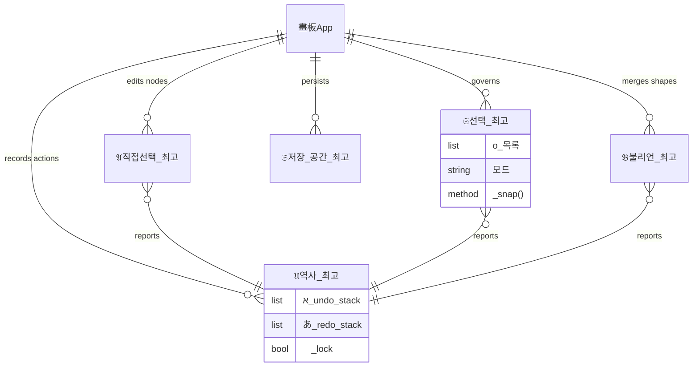

# 𔓕 Supre-me Vector Workstation 𑗊
# אבג あいう ሀ ሀ ለ क ख

## ꧄ ꧅ Ye Word of Ye Werk (Middle English)
> *Here bigynneth the boke of Supre-me Illustrator, a werk of grete witte and craft. In this boke ye shal fynde how to drawe with nodes of Bezier and how to joyne shapes by the art of Boolean. It is a tool for the clerkes and the artisans who seken to bilde ymages of passinge fairness and stabilitee. Blessed be the hand that governeth the penne in this digital scriptorium.*

## ᄠᅳᆮ : 그림 기계의 ᄂᆡ력 (Middle Korean)
> *이 기계ᄂᆞᆫ ᄉᆡᆨᄀᆞᆯ과 곡선을 견정ᄒᆞ여 그림을 ᄆᆡᆼᄀᆞᄂᆞᆫ 일에 쓰ᄂᆞᆫ 것이ᄅ라. ᄂᆞᆫᄒᆞ거나 합ᄒᆞᄂᆞᆫ 법(Boolean)이 깊고, 마ᄃᆡ(Bezier)를 다ᄉᆞ리ᄂᆞᆫ 솜씨가 겸비ᄒᆞ여 쓰기에 편ᄒᆞᆫ 것이ᄅ라. 이를 쓰ᄂᆞᆫ 이ᄂᆞᆫ ᄆᆞᄍᆞᆷᄂᆡ 아름다움을 이룰 지로다.*

---

### 𓊍 Engine Architecture (ERD)

---

### ♩ ♪ ♫ Installation
`pip install -r requirements.txt`

### ♬ License
GNU GPLv3
Copyright < 이호세 Rheehose (Rhee Creative) 2008-2026 >
