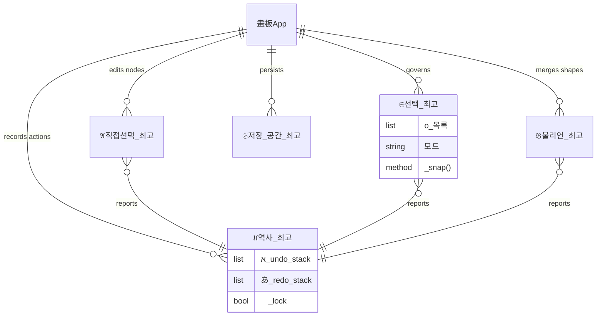

# 𔓕 Supre-me Vector Workstation 𑗊
# אבግ あいう ሀ ሀ ለ क ख

## ꧄ ꧅ Ye Word of Ye Werk (Middle English)
> *Here bigynneth the boke of Supre-me Illustrator, a werk of grete witte and craft. In this digital scriptorium, ye shal fynde how to drawe with nodes of Bezier and how to joyne shapes by the art of Boolean—be it by Union of many, or by the Subtraction of one from an-other. It is a tool for the clerkes and the artisans who seken to bilde ymages of passinge fairness and stabilitee. Blessed be the hand that governeth the penne, following the Snapping of Guydes like a lodestone that draweth the iron to its true place.*

## ᄠᅳᆮ : 그림 기계의 ᄂᆡ력 (Middle Korean)
> *이 기계ᄂᆞᆫ ᄉᆡᆨᄀᆞᆯ과 곡선을 견정ᄒᆞ여 그림을 ᄆᆡᆼᄀᆞᄂᆞᆫ 일에 쓰ᄂᆞᆫ 것이ᄅ라. ᄂᆞᆫᄒᆞ거나 합ᄒᆞᄂᆞᆫ 묘리(Boolean)가 깊고, 마ᄃᆡ(Bezier)를 다ᄉᆞ리ᄂᆞᆫ 솜씨가 겸비ᄒᆞ여 쓰기에 편ᄒᆞᆫ 것이ᄅ라. 자석ᄎᆞᄅᆞᆷ 붙ᄂᆞᆫ 선(Snap)이 있어 자리를 ᄆᆞᆽ추기가 ᄆᆞᄍᆞᆷᄂᆡ 쉽고, 이를 쓰ᄂᆞᆫ 이ᄂᆞᆫ 허ᄆᆞᆯ 없이 아름다움을 이룰 지로다.*

---

### 𓊍 Engine Architecture (ERD)

---

### ꧅ Ye Way of Labour (Workflow)

1.  **Drawn with the Penne** (あ): *Create points and anchors of curven lines.*
    - ᄠᅳᆮ : 구비진 선을 그려 마ᄃᆡ를 ᄆᆡᆼᄀᆞᄂᆞᆫ 것이ᄅ라.
2.  **Joyne thy Shapes** (א): *Merge polygons by the magical Boolean art.*
    - ᄠᅳᆮ : 도형을 합ᄒᆞ거나 ᄂᆞᆫᄒᆞᄂᆞᆫ 것이ᄅ라.
3.  **Snap to Trouth** (ሀ): *Align thy werke with the guydes of the Digital Lodestone.*
    - ᄠᅳᆮ : 자석ᄎᆞᄅᆞᆷ 붙ᄂᆞᆫ 선에 자리를 ᄆᆞᆽ추ᄂᆞᆫ 것이ᄅ라.
4.  **Save thy Scriptum** (क): *Store thy craft in the eternal .sup format.*
    - ᄠᅳᆮ : 모습을 자바두어 다시 보게 ᄒᆞᄂᆞᆫ 것이ᄅ라.

---

### ♩ ♪ ♫ Installation
`pip install -r requirements.txt`

### ♬ License
GNU GPLv3
Copyright < 이호세 Rheehose (Rhee Creative) 2008-2026 >
