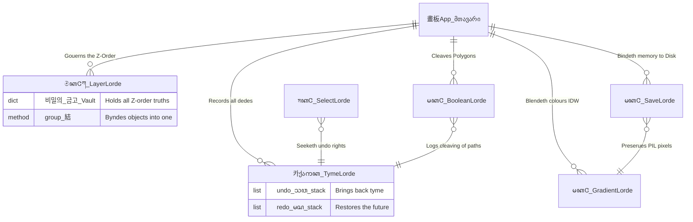

<div align="center">

# 𔓕 𑗊 𓈖 𗀀 𗀁 *Supre-me Vector Workstation* 𔄀 𔓕 𓊍 
### **The Boke of Supre-me Ymagerie / 繪圖機關 訓民正音 混合 說明書**


</div>

<br/>

## ⚔️ Here Bigynneth Ye Hystorye of Ye Werk (Arthurian Englysshe)

> *Harken ye, lordes and ladyes, of a maruelous instrument yclept "Supre-me", forgyn by the handes of **Rheehose**. In the daies of kynge Uther Pendragon, neuer was seyn suche a craft of draweing. This scriptorium digitalis byndeth the uectors and nodes of Bezier euen as Merlyn byndeth the wyndes. By the arte of Shapely, polygons are departyd and rejoyned—what sum call the "Boolean Magecræft." It holdeth infinite tylynges in its back-grounde, and kepeth euerie dede of mannes errour within ye "Tyme Lorde" cronicles (hich sum moderne clerkes call "un-doe"). Trulye, it is the Excalibur of alle painters.*

---

## 📜 新羅之 語音 訓民正音 混合 (Ancient Korean: Three Kingdoms & Old Hangul)

> *大智圖 繪作機關 (대지도 회작기관) 內歷 (내력) — 皇龍寺 築造之 秘術 (황룡사 축조지 비술)*
> 
> *이 기계ᄂᆞᆫ 신라(新羅)와 고구려(高句麗)의 갑사(甲士)ᄃᆞᆯ이 황룡사(皇龍寺)를 지을 적에 쓰던 각도(角度)와 마ᄃᆡ(節)를 다ᄉᆞ리ᄂᆞᆫ 비술(秘術)이ᄅ라. 백제(百濟) 아비지(阿非知)의 솜씨를 빌려 점과 점을 ᄆᆡᆺᄂᆞᆫ 구비(Bezier)를 이룹고, 흩어진 모양(圖形)을 굳게 합ᄒᆞ거나(Union) ᄇᆡ허ᄂᆡᄂᆞᆫ(Subtract) 기적을 보이ᄂᆞ니라.*
> 
> *돌이키ᄂᆞᆫ 챽(歷史/TymeLorde)이 잇서 그릇된 붓질을 수백 번 돌이킬 수 잇ᄉᆞᆸᄆᆡ, 이를 쓰ᄂᆞᆫ 화공(畵工)은 ᄆᆞᄍᆞᆷᄂᆡ 천하(天下)의 빛ᄁᆞᆯ을 하나로 아우를 지로다. (SVG/PNG 變換의 魔法).*

---

## 🏰 Ye Greate Engyne Archytecture (Internal ERD)

Below drawen is the carte of the inner werkes, writ in the runes of *Mermaid*. Yt reuealeth how the Lordes of Layers, Tyme, and Booleans common togeþer.



---

## 𗀅 The Booke of Magyck Artefactes (Features)

### 1. The Arte of Bezierye (직접선택 및 베지어 곡선)
*Whan a knyght draweth his blade, yt is smooth. So ys the Bezier werke. Ye may dragge the ancors and hondles, and the curve abideth true.*
* ᄠᅳᆮ : 곡선의 마ᄃᆡ(節)와 핸들(柄)을 대낭양(Adobe) 일러스트레이터 ᄎᆞᄅᆞᆷ 유연하게 움직여 그림의 굴곡을 정ᄒᆞᄂᆞᆫ다.

### 2. Ye Endlesse Fielde (무한 공간 삼각 분할 배경)
*A felde wiþoute mete nor ende, grid-marked for þe sure measure of the craftsman.*
* ᄠᅳᆮ : 무한히 뻣어나가ᄂᆞᆫ 그리드 격자를 통해 쥘 수 없ᄂᆞᆫ 공간(空間) 까지 캔버스를 확장ᄒᆞ여 작업ᄒᆞᆫ다.

### 3. Ye Alchemye of Coloures (자유형 그라디언트 IDW)
*Melding hues as if by sorserie, wyth freeforme poynts. We call upon ye `PIL` magicks.*
* ᄠᅳᆮ : 점을 찍ᄂᆞᆫ 곳마다 빛ᄁᆞᆯ이 물들어 거리에 따라 역가중치(IDW)로 섞이ᄂᆞᆫ 신비로운 채ᄉᆡᆨ(色彩) 기법이ᄅ라.

### 4. The Preseruacioun of Writte (SVG 및 JSON 무손실 추출)
*Thy work shale be wroten into XML and Base64, kept safe fro the ravages of Tyme.*
* ᄠᅳᆮ : 아무리 복잡ᄒᆞᆫ 선이라도 W3C 표준의 SVG로 꺠짐 없이 캔버스를 보존ᄒᆞ며, 그라데이션은 Base64 바이너리로 알윽에 머금은 ᄎᆡ `sup` 파일로 남ᄂᆞ니라.

---

## 𗀆 Ye Ordre of Installacioun 

*To brieng forthe this engyn into þy own castel:*

```bash
# Thou must install the sacred requirements
# ᄠᅳᆮ : 이 기계를 헐을챼기 위한 준비물이로다.
pip install -r requirements.txt
```

*Then, striketh the fyrst blow:*

```bash
# ᄠᅳᆮ : 기계의 심장을 울리ᄂᆞᆫ 주문이ᄅ라.
python main.py
```

---

## 𗀇 The Knyght's Coda (License)

**GNU GPLv3**
Written by the Scribe `< 이호세 Rheehose (Rhee Creative) 2008-2026 >`.
*Euen as Arthur holdeth Avalon, Rheehose holdeth the copye-right of thys code. Use yt well in þy aduentures.*
* ᄠᅳᆮ : 이 모든 비술은 이호세(Rheehose) 의 것이니, ᆨ뭔들은 이를 널리 이롭게 쓰ᄃᆡ 엄격히 법도(GPL)를 ᄄᆞ를지어다.
